# DCC-turnout-decoder

Стрелочный DCC декодер для железнодорожного моделизма.

## Набор

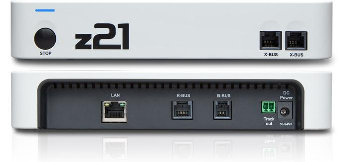

- [Roco z21](https://www.z21.eu/en/z21-system/the-models) белая (с чёрной Z21 всё будет также).
- Рельсы и стрелки [Tillig](https://www.tillig.com/eng/index.html) TT.
- Стрелочные электрические приводы [Tillig 83531](https://www.tillig.com/Produkte/produktinfo-83531.html) (правый) и [Tillig 83532](https://www.tillig.com/Produkte/produktinfo-83532.html) (левый).

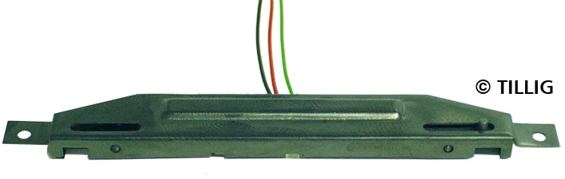

Собрав всё это вместе получается модель железной дороги с управляемыми стрелочными развязками с цифровым управлением DCC. 

Задача декодера: слушает команды, что по рельсам посылает командная станция, которая говорит примерно следующее: "Тому декодеру, у которого адрес N перевести стрелку с адресом NN в такое-то положение!". Если команда предназначается ему, то он выполняет некое действие.

**Адресация для Roco z21**

|Адрес декодера|Адреса портов|
|:---:|:---:|
|0|	1, 2, 3, 4|
|1|	5, 6, 7, 8|
|2|	9, 10, 11, 12|
|3|	13, 14, 15, 16|
|...|...|

У других декодеров адресация может отличаться.

>Вольный перевод "[Why are the turnout addresses of some turnout decoders shifted by 4?](http://www.z21.eu/en/FAQ-Support/FAQ#1259)"
>
>**Почему адрес стрелки некоторых стрелочных декодеров сдвинут на 4 и вообще как оно устроено?**
>
>Каждый декодер имеет 4 адреса стрелок (“порта”). Разные командные станции могут начинать нумерацию своих декодеров по-разному: с 0 или 1. Из-за этого может возникнуть путаница связанная со сдвигом адресов стрелок на 4.
>
>Из-за отсутствия единого стандарта оба метода начала нумерации применяются разными командными станциями на равных правах.
>
>Roco всегда нумерует свои адреса стрелочных декодеров начиная с 0. Другие DCC контроллеры могут начинать нумерацию с 1.
>
>Roco рассчитывает адрес так:
>
>**Адрес стрелки = адрес декодера * 4 + адрес порта (от 1 до 4)**
>
>Другие командные станции, начинающие нумерацию с 1, считают так:
>
>**Адрес стрелки = (адрес декодера - 1) * 4 + адрес порта (от 1 до 4)**
>
>Например:
>
>Если стрелке, имеющей адрес декодера 1 и адрес порта 1, посылается сигнал, то адрес такой стрелки будет определен командной станцией Roco как
>
>**Адрес стрелки = 1 * 4 + 1 = 5**
>
>Однако другая командная станция (которая начинает нумерацию с 1), рассчитает адрес вот так:
>
>**Адрес стрелки = (1-1) * 4 + 1 = 1**
>
>В связи с такими различиями в подсчёте, при переходе с некой командной станции на Roco z21, из-за различных вариантов расчёта адреса стрелки, произойдёт сдвиг адреса на 4. То есть та стрелка, что была с адресом 1, станет доступна z21 уже по адресу 5.
>
>Особенно неудобно, когда номер нового стрелочного декодера программируется посредством CV, а изначально он имеет адрес именно 1.
>
>Для более простого перехода в таких ситуациях в "[Z21 Maintenance Tool](https://www.z21.eu/en/products/z21-maintenance-tool)" есть опция "DCC tournout-addressing according to RCN-213" (в версиях firmware до 1.32 опция называется "DCC turnout address displacement +4"), установив которую расчёт адреса стрелки будет по алгоритму Roco.
>
>Хотелось бы отметить, что такие проблемы возможны не у всех декодеров, например со стрелочными декодерами Motorola у Roco всё будет в порядке.
>
>

## Теория

Стрелочный декодер сделан с  помощью [Arduino Nano](https://www.arduino.cc/en/Main/arduinoBoardNano)

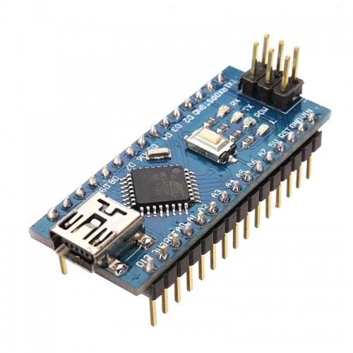

и залитого в него скетчем, в соответствии с которым декодер выдаёт на свои определённые цифровые выходы сигнал, который замыкает или размыкает контакт на стрелочном электрическом приводе, который с помощью соленоида двигает маленькую палочку, которая и переводит стрелку.

Для создания стрелочного декодера используется 11 цифровых пинов D2-D12 из Arduino Nano.

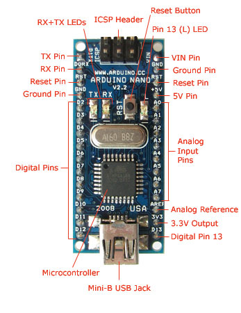

Один пин D2 забирается под приём DCC команд в режиме INPUT. Каждому стрелочному приводу надо два пина в режиме OUTPUT, то есть оставшиеся 10 пинов делённые на 2 дают 5, т.е. стрелочный декодер может управлять пятью стрелками.

Однако выше было сказано про нумерацию, что каждый декодер имеет свой адрес и управляет только четырьмя стрелками, а мы в хотим пять. Не будем терять такую возможность. Выходим из ситуации так - скетч будет знать как обрабатывать два декодерных адреса на одном устройстве.

Например можем дать ему адреса 3 и 4. И тогда наш декодер будет принимать только команды предназначенные декодеру 3 (стрелкам 13, 14, 15, 16) и декодеру 4 (стрелке с адресом 17). Хотя адреса стрелок 18, 19, 20 декодера 4 мы и "потеряем".

Эта потеря не страшна (если не собирается *большой* макет) - количество адресов декодеров большое (так у z21 их 128, а у Z21 - 1024), а вот самих адресов для стрелок у каждого декодера только четыре.

>Для некоторого закрепления: если дать декодеру адреса 5 и 6, то стрелки имели бы адреса 21, 22, 23, 24 и 25. И у декодера 6 пропали бы адреса стрелок 26, 27, 28.

## Принципиальная схема

Исполнено в [Fritzing](http://fritzing.org/).

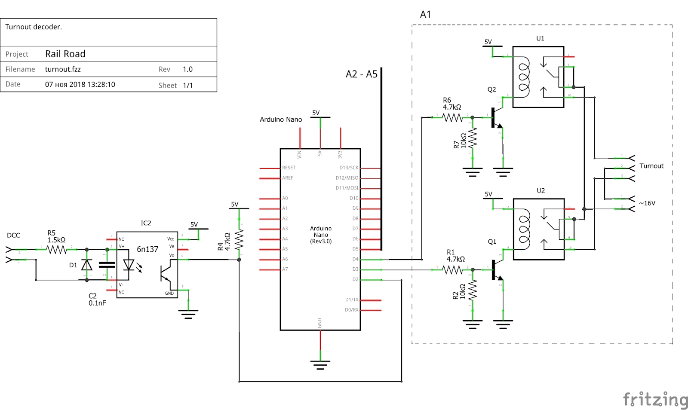

## Всё что надо

|Наименование|Количество|
|---|:---:|
|Глянцевая бумага (лучше спец. бумага) А5|1|
|Стеклотекстолит 100х100 мм|1|
|Хлорное железо|1|
|Изопропанол|1|
|Arduino Nano 3.0|1|
|Клеммник 3-контактный KLS2-128-5.00-03P-4S|5|
|Клеммник 2-контактный KLS2-128-5.00-02P-4S|3|
|Реле V23079A1001B301|10|
|Резистор 0.25 Вт, 4.7 кОм|11|
|Резистор 0.25 Вт, 10 кОм|10|
|Резистор 0.25 Вт, 1.5 кОм|10|
|Транзистор SS8050|10|
|Оптопара 6N136|1|
|Конденсатор 0.1 nF|1|
|Диод 1T4156|1|

## Проектирование с помощью Sprint-Layout

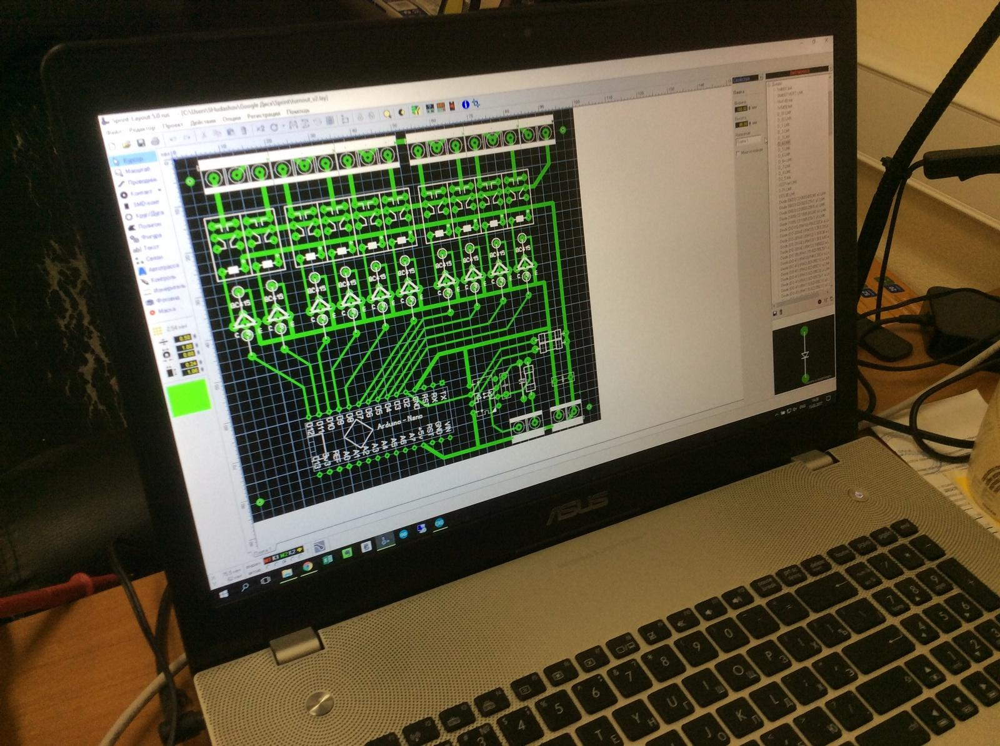

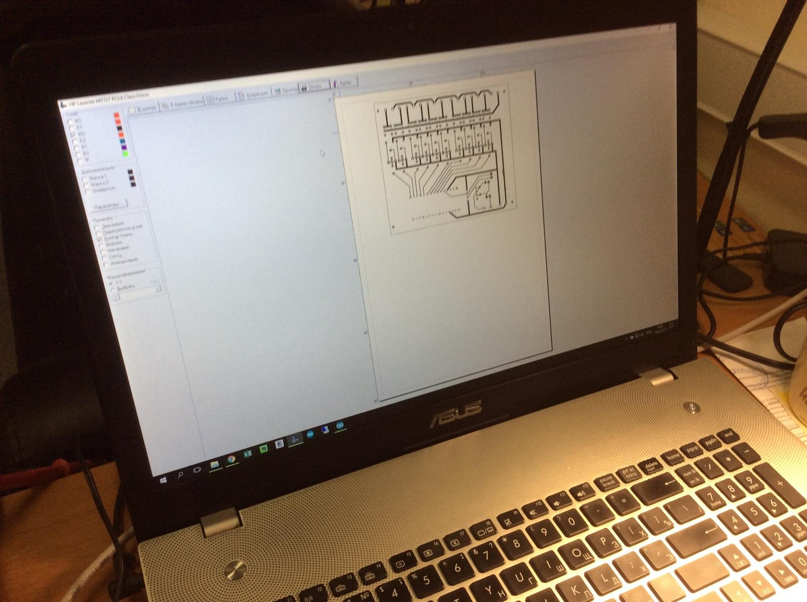

## Лазерно-утюжная технология

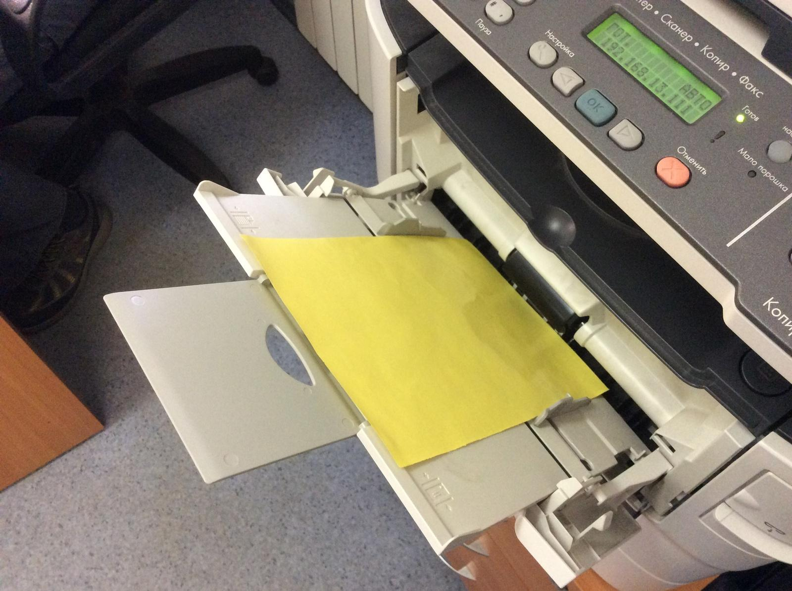

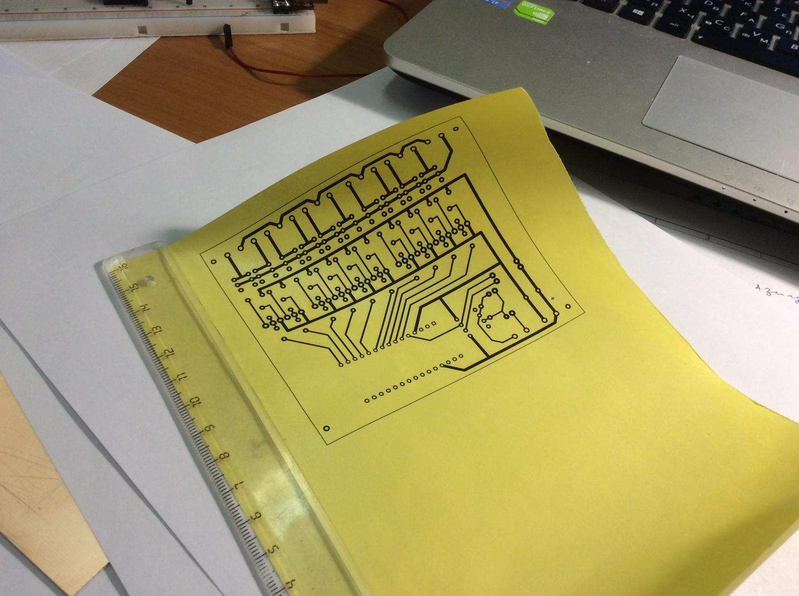

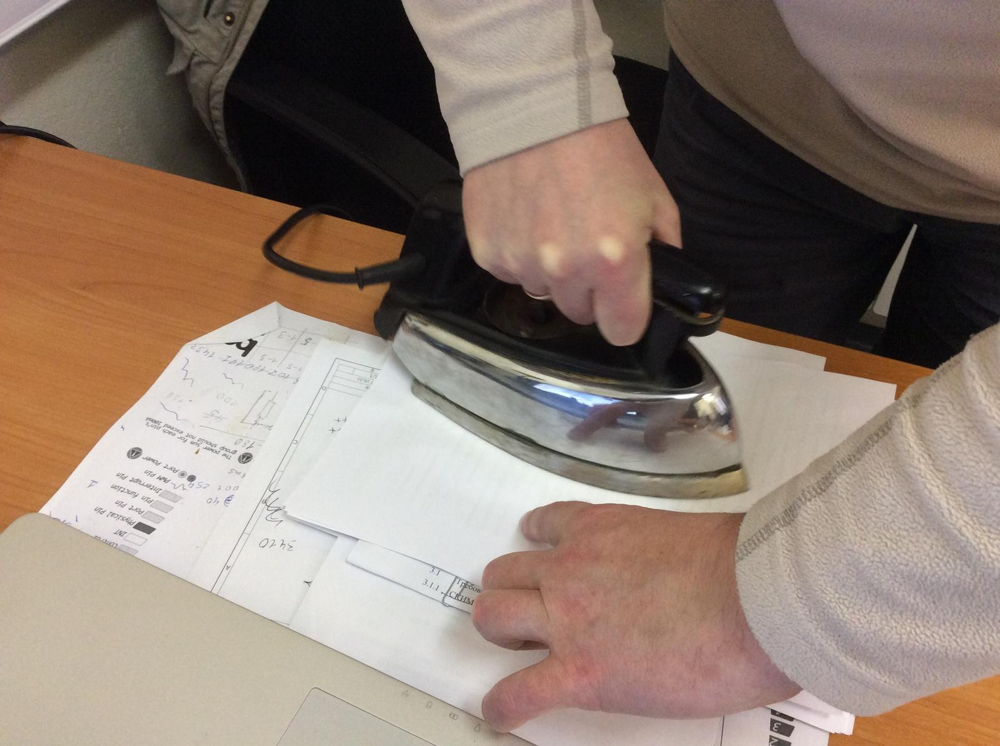

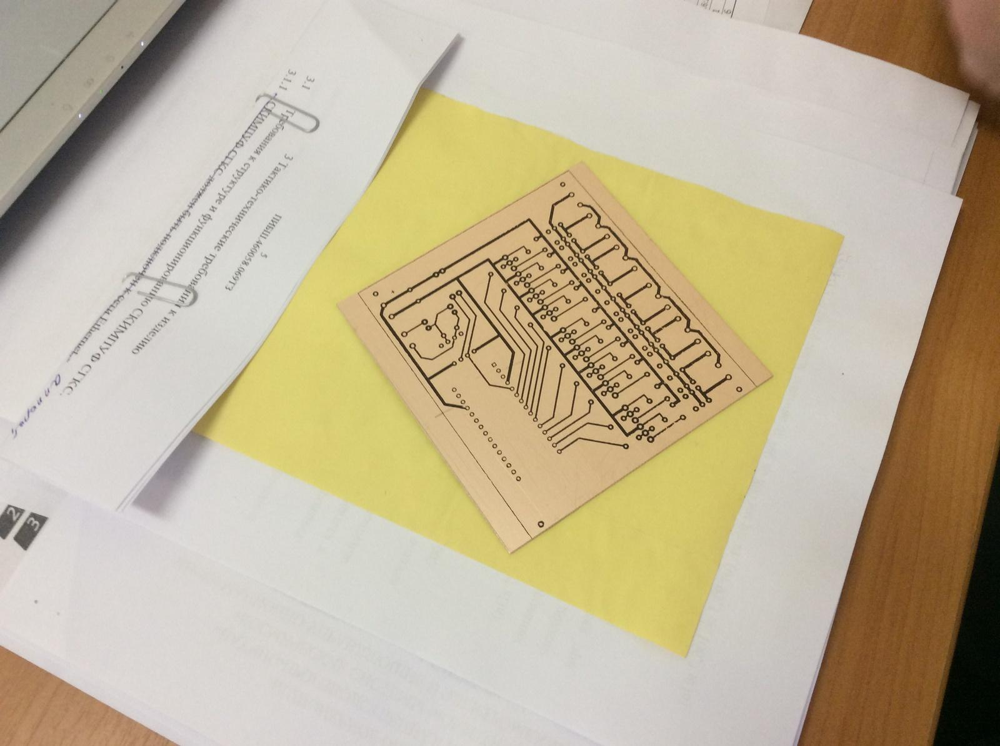

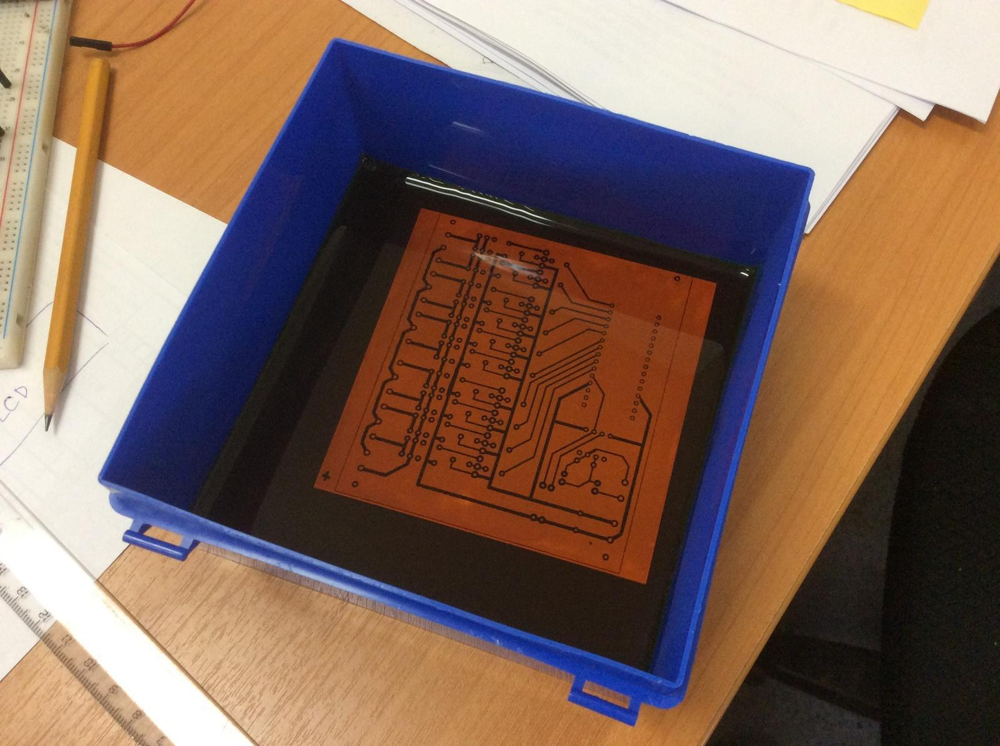

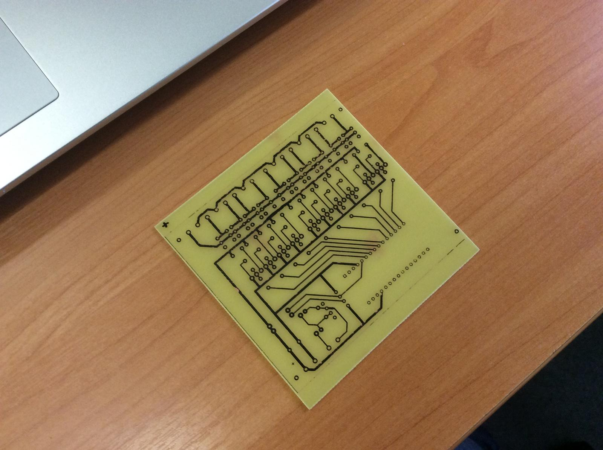

## Пайка и подключение

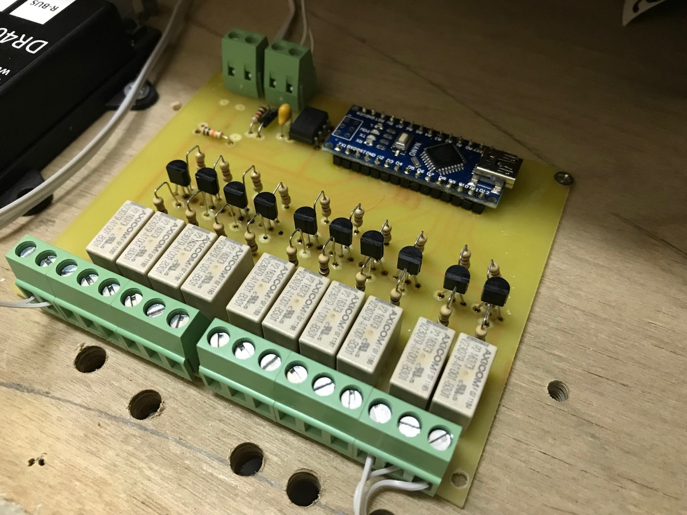

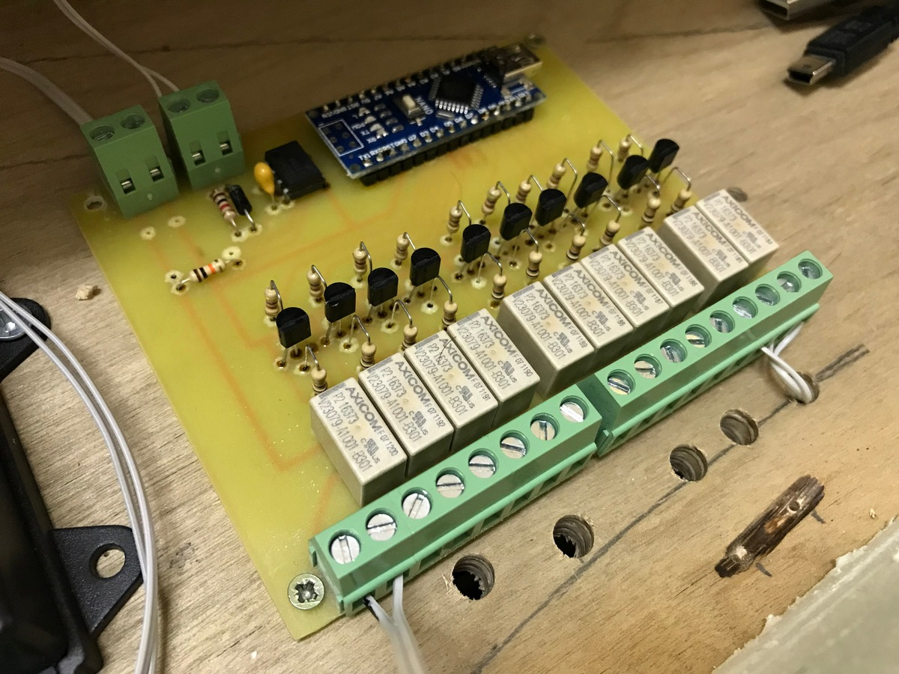

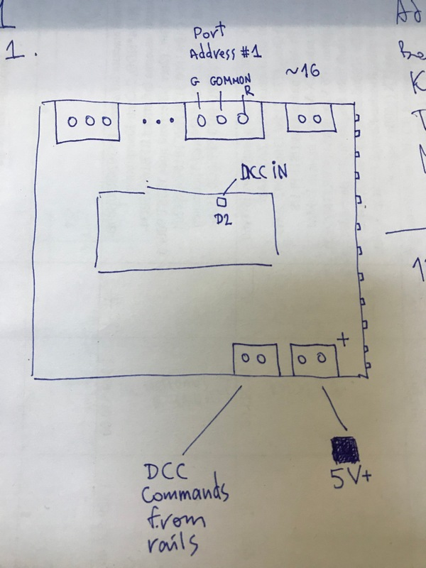

Не забываем залить [скетч](https://github.com/killadog/DCC-turnout-decoder/blob/main/dcc_turnuot_V2.00.ino) в Arduino.

## Электропитание

Правильное электропитание устройств железнодорожного макета (декодеров, стрелочных электрических приводов и т.п.) имеет свои нюансы. Приводы стрелок [Tillig 83531](https://www.tillig.com/Produkte/produktinfo-83531.html) и [Tillig 83532](https://www.tillig.com/Produkte/produktinfo-83532.html) на **соленоидах** используют переменное синусоидальное напряжение амплитудой 15 В, а Arduino питается постоянным током 5 В. Эти два напряжения и были выбраны в качестве основных питающих, которые будут использоваться в макете.

Небольшое отступление: большинство современных источников питания китайских товарищей - импульсные. И получить с них требуемое для приводов стрелок переменное напряжение задача не то, чтобы невозможная, но силы и время лучше потратить на более творческий процесс и поэтому выбор падает на силовой трансформатор: тороидальный трансформатор 220 В 100 Вт, вторичная обмотка 15 В, есть отвод на 12 В. Ток нагрузки до 6 А (по паспорту приводы стрелок потребляют в момент перевода 1 А каждый, соответственно запас по току лишним не будет).

15 В переменного тока отводятся на клеммник для питания электрических приводов стрелок и одновременно уходят на классический диодный мост с электролитическим конденсатором, чтобы стать постоянным током, из которых и получается 5 В для питания Arduino на декодере.

### Потребуется:

- Электрическая розетка 220 В.
- Трансформатор (о нем мы уже говорили).
- Выключатель.
- Автоматический размыкатель YA-0701 3 А, он же автомат защиты на случай если что-то пойдет не так.
- Диодный мост KBU6005 проходит по токам/напряжениям.
- Электролитический конденсатор 2000 мФ 30 В (первый попавший в руки). Напоминание - с трансформатора на выходе получается 15 В переменки, а после диодного моста на конденсаторе напряжение будет уже 21 - 22 В.
- Стабилизатор. Вот тут подробнее: обычный стабилизатор на КР142ЕН5А прост и общедоступен, но ожидается большой разброс по потреблению - светофоры, освещение, звуковое оформление, может еще что, значит нужно что-то мощнее и эффективнее. Китай предлагает много решений на базе DC-DC конвертера GS2678 - им и воспользуемся.
- Токовый датчик - широко известный MAX471. Следить за потребляемым током, выводить значение на экран, а в случае перегрузки - отключать потребителей при помощи реле например.

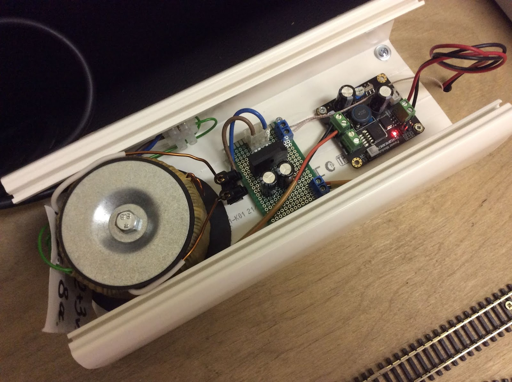

Работает.

## Rocrail

Настройка 1-ой стрелки для 4-го декодера (адрес 17)

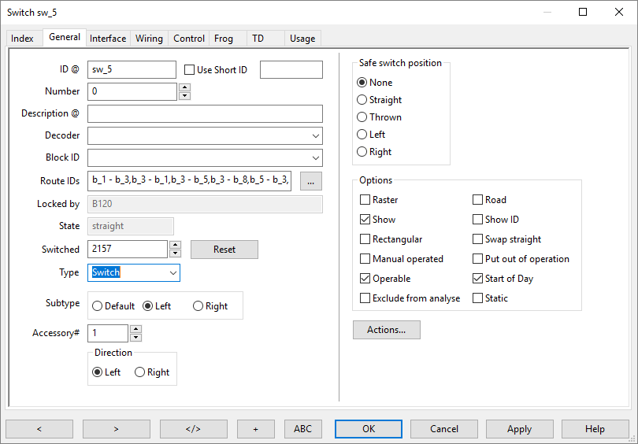

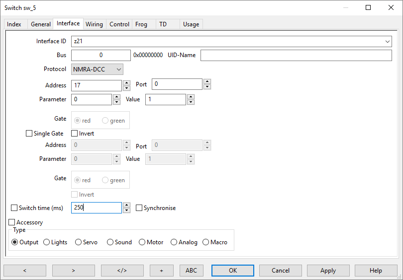

Пример автоматического управления стрелками в [Rocrail](https://wiki.rocrail.net/doku.php)

[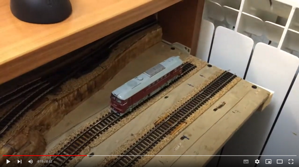](https://youtu.be/0nPtjIS2L_g)

## Итог

Что получилось? Правильный стрелочный декодер. Точнее два стрелочных декодера на одной плате. Собран из доступных деталей. Выводит принятые DCC команды на COM порт для мониторинга.

Командная станция не проверяет была ли исполнена отправленная команда, то есть перевёл ли в итоге стрелочный привод стрелку или нет. Причины сбоя могут быть разными: потерялась команда по пути из-за плохого контакта рельсов, что-то с питанием декодера, ошибки в скетче и так далее.

Про датчики обратной связи на стрелочные приводы, которые позволяют отслеживать текущее настоящее положение стрелки - отдельная тема. Здесь только о решении перевода стрелок с помощью стрелочного декодера.

PS: Итак это декодер на 5 стрелок. Используя другие версии Arduino, расширители портов  (например [MCP23017](https://www.microchip.com/wwwproducts/en/MCP23017)) можно увеличить количество управляемых стрелок. Используя NNNN вместо реле можно изменить схему. Скетч нужно и можно править до идеала. Нет предела совершенству.

## Файлы

- turnout_v.2.00.lay - для изготовления платы в формате Sprint Layout
- [Library for Arduino for decoding dcc signals](https://github.com/MynaBay/DCC_Decoder) - библиотека для NMRA DCC декодеров
- dcc_turnuot_V2.00.ino - скетч для Arduino

## Бонус

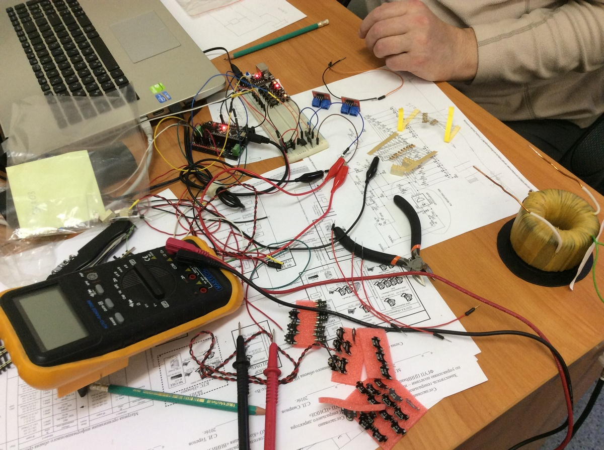

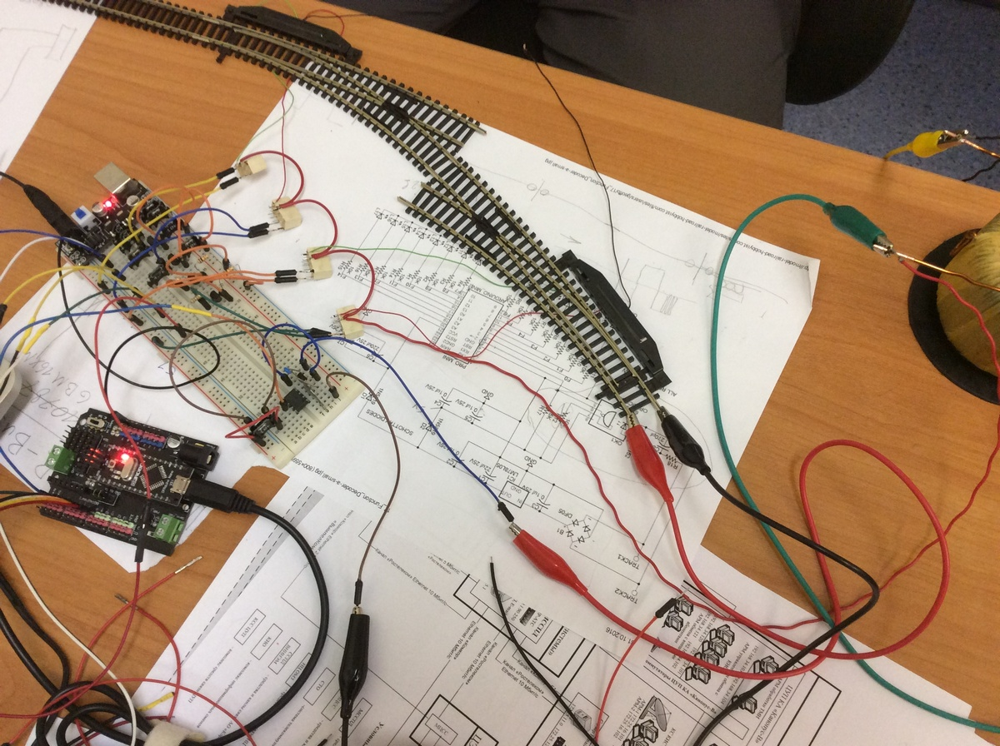

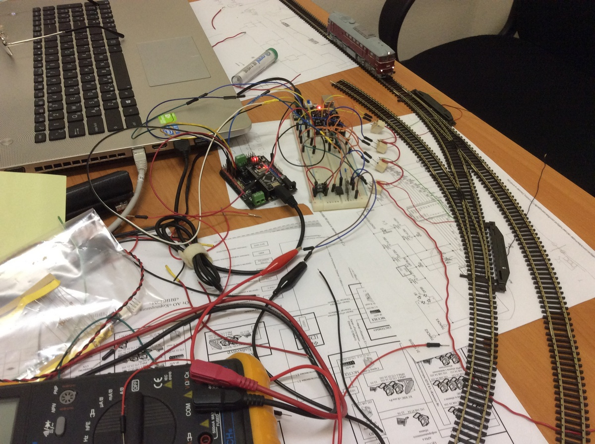

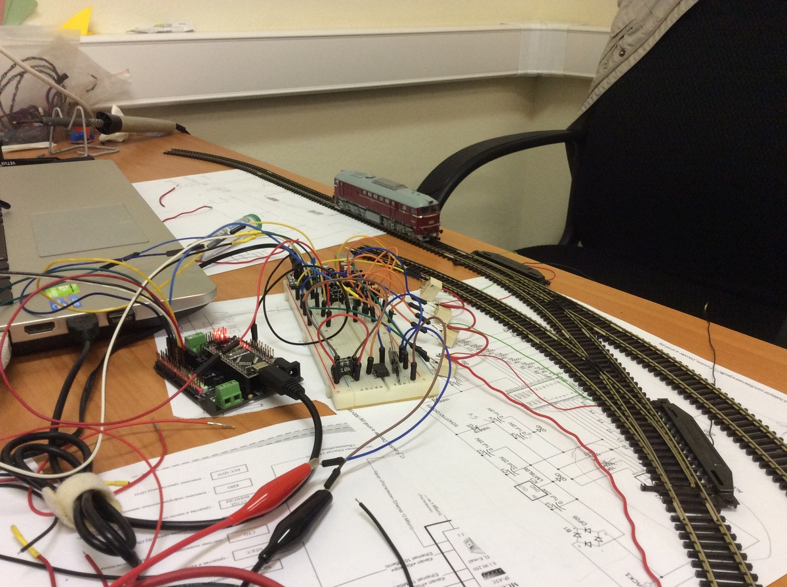
